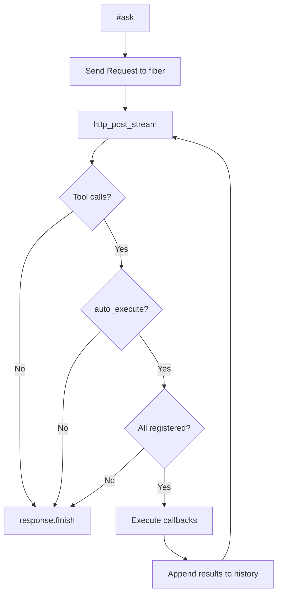

# AGENTS.md — Architecture & quirks

## Overview

`agent-cr` wraps an OpenAI-compatible streaming chat-completion endpoint behind
a fiber-based async interface. The `Agent` class owns a background fiber that
serialises requests — each `#ask` sends a `Request` on an unbuffered channel,
the fiber processes it, and signals completion through the `Response` object's
channels.

## File layout

```
src/
  agent.cr              # entry point, requires sub-files
  agent/
    version.cr           # VERSION constant
    config.cr            # Agent::Config — API endpoint, key, model, system_prompt, etc.
    message.cr           # Agent::Message, ContentPart, ToolCall, Usage
    response.cr          # Agent::Response — async handle with stream/join/finished
    agent.cr             # Agent + Tool — main loop, HTTP streaming, request serialisation
```

## Architecture diagram

```mermaid
sequenceDiagram
    participant Caller
    participant Agent
    participant Fiber
    participant HTTP as HTTP::Client
    participant API as OpenAI API

    Caller->>Agent: ask("hello")
    Agent->>Agent: build Message, append to history
    Agent->>Fiber: send(Request) on @request_channel
    Agent-->>Caller: return Response (immediately)

    Fiber->>Fiber: receive(Request) from channel
    Fiber->>HTTP: POST /v1/chat/completions (stream=true)
    HTTP->>API: HTTPS request
    API-->>HTTP: SSE stream
    loop each SSE chunk
        HTTP-->>Fiber: yield line
        Fiber->>Response: push_chunk(delta)
        alt caller called #stream
            Response->>Caller: chunk via channel
        else caller blocks on #message
            Response: buffer in @chunk_channel (size 256)
        end
    end
    Fiber->>Response: finish(message, usage)
    Response->>Caller: #message / #metadata unblock
```

## Key patterns

### Fiber-per-agent

Each `Agent.new(config)` spawns a persistent fiber:

```crystal
@fiber = spawn { run_loop }
```

`run_loop` blocks on `@request_channel.receive`. When a `Request` arrives it
calls `http_post_stream` directly, processes the SSE stream, and appends the
assistant reply to `@history`. After the HTTP call completes, the fiber loops
back and waits for the next request. This serialises requests through one
fiber — no locking needed.

### Request / Response decoupling

`#ask` does three things synchronously:
1. Builds a `Message`
2. Creates a fresh `Response` object and sends a `Request` (messages + tools + response)
3. Appends the message to `@history` only after the channel send succeeds

It returns the `Response` immediately. The calling fiber is free to read
chunks, wait for the message, or do other work.

Appending to `@history` after the send ensures that if `close()` races with
`#ask()`, an orphan message is never left in history.

### Buffered chunk channel

`Response` has three channels:
- `chunk_channel` — size **256** (buffered). The HTTP fiber can push up to
  256 tokens without blocking, even if nobody calls `.stream`. This means
  `agent.ask("...").message` works without deadlocking.
- `message_channel` — size **1** (buffered). Signals the final `Message`.
- `usage_channel` — size **1** (buffered). Signals `Usage`.

The `finish` method sends to both message and usage channels, then closes
the chunk channel:

```crystal
def finish(message, usage)
  @message_channel.send(message)
  @usage_channel.send(usage)
  @done = true
ensure
  @chunk_channel.close
end
```

Closing `chunk_channel` after the block ensures the `ensure` runs even if
`send` raises — and the close signals `#stream` to exit its receive loop.

### Non-blocking push for streams

`push_chunk` uses `send` (not `try_send` / `spawn`) because the buffer is
large enough for typical streaming. If the buffer somehow fills up, the HTTP
fiber will briefly block — this is acceptable backpressure.

## SSE parsing

The streaming handler in `http_post_stream` reads `body_io.each_line` and
processes SSE `data:` lines:

- Lines that are empty, `data: [DONE]`, or don't start with `data: ` are
  skipped.
- The `data: ` prefix is stripped, the remainder is parsed as JSON.
- Tool call deltas are accumulated across chunks by index (OpenAI sends
  `id` on the first delta and `arguments` in pieces).
- Usage metadata is parsed from whichever chunk contains it (usually the
  final chunk with `finish_reason: "stop"`).

## Messages

### Content serialisation

`Message#to_request_body` produces the JSON hash sent to the API. Content
can be:
- A plain string (`role: "user", content: "hello"`)
- An array of content parts (text + image_urls for multimodal)
- `null` (tool result messages, tool call messages)

The `JSON::Any` wrapping is verbose but necessary — Crystal's JSON builder
requires explicit `JSON::Any` wrapping when building hash literals.

### Tool calls

`ToolCall` stores `id`, `name`, and `arguments` (a JSON string). On the wire
they're formatted as:

```json
{
  "tool_calls": [{
    "id": "call_abc",
    "type": "function",
    "function": { "name": "get_weather", "arguments": "{\"city\":\"Paris\"}" }
  }]
}
```

### Reasoning content

Reasoning (e.g. `reasoning_content` from DeepSeek/Qwen models) is **not**
merged into `message.content`. It is stored separately in
`message.reasoning` and streamed as `ChunkKind::Reasoning` chunks. This
keeps `content` clean for downstream consumers.

## Quirks and gotchas

### `JSON::Any` boilerplate

Crystal's `JSON::Any` doesn't auto-coerce Hash literals. Every value in a
`Hash(String, JSON::Any)` literal needs explicit wrapping:

```crystal
# Right:
{"key" => JSON::Any.new("value")}

# Wrong — compile error:
{"key" => "value"}
```

`build_request_body` and `Message#to_request_body` handle this with `.map { |h| JSON::Any.new(h) }` on intermediate arrays.

### ToolCallDelta struct

Tool-call deltas across SSE chunks are accumulated in a `ToolCallDelta`
private struct (`@id`, `@name`, `@arguments`), keyed by the delta's `index`
field. This replaces an earlier positional-`Array(String)` approach and is
much clearer.

### Fiber scheduling

Crystal's cooperative scheduling means a fiber blocked on `Channel.receive`
won't run until the current fiber yields. The `Channel.send` operation
yields to a waiting receiver, so `@request_channel.send(...)` in `#ask`
transfers control to the agent fiber. No explicit `Fiber.yield` is needed.

### Channel close ordering

`finish` sends to `message_channel` and `usage_channel` *before* closing
`chunk_channel`, and also captures the `finish_reason` from the API
("stop", "length", "tool_calls", etc.) exposed as `Response#finish_reason`.

This ordering matters:
- The consumer (blocked on `#message` or `#metadata`) can unblock before
  the chunk channel is closed.
- The `ensure` block guarantees the chunk channel is always closed, even
  if a send raises `Channel::ClosedError`.

### Mock server in tests

The integration spec (`spec/agent_spec.cr`) starts a local `HTTP::Server`
on a random port (`bind_tcp(0)`) and passes the port to the test block. The
server is spawned into a background fiber. Each test gets its own port so
tests can run in parallel.

The mock server must call `ctx.response.close` after writing SSE data,
otherwise the HTTP client will block waiting for more data (the `each_line`
reader waits until EOF/connection close).

### Error handling

All errors produced by the agent use a consistent prefix `"Agent error: ..."`
so callers can pattern-match programmatically.

If `http_post_stream` raises (network error, non-200 status, JSON parse
failure), the error is caught in `http_post_stream`'s own rescue block, which
calls `response.finish` with an error message. This ensures `#message` and
`#join` always unblock.

## Development workflow

### Prerequisites

- Crystal >= 1.10
- `OPENAI_API_KEY` environment variable set when running integration tests against a real API.

### Setup

```sh
shards install
```

### Compile

Check that the shard compiles cleanly:

```sh
crystal build src/agent.cr
```

Or, to type-check without producing a binary:

```sh
crystal tool hierarchy src/agent.cr 2>&1 | head -5
# or just:
crystal build --no-codegen src/agent.cr
```

### Run tests

All specs are written using Crystal's built-in `Spec` framework:

```sh
crystal spec
```

Run a single spec file:

```sh
crystal spec spec/agent_spec.cr
```

Filter tests by name:

```sh
crystal spec --tag ~remote   # skip tests that require a real API
crystal spec -e "streaming" # only specs whose description matches "streaming"
```

> **Note:** The mock server in `spec/agent_spec.cr` uses a random port so tests can run in parallel. Each test starts its own `HTTP::Server` and calls `ctx.response.close` after writing SSE data to avoid hanging the HTTP client.

### Format

All Crystal source must be formatted with the standard formatter before committing:

```sh
crystal tool format
```

### Lint

Run the Ameba style linter (installed via `shards install` → `bin/ameba`):

```sh
bin/ameba
```

Lint and format can be checked together:

```sh
bin/ameba && crystal tool format --check
```

### Adding a new feature

1. Add the implementation in `src/agent/` under the appropriate file.
2. Add corresponding unit tests in `spec/`.
3. If the feature changes the public API (new method/additional parameter), update `README.md` with an example.
4. Run `crystal spec` to confirm nothing is broken.
5. Run `crystal tool format` to ensure consistent formatting.

### Releasing

1. Bump the version in `shard.yml` and `src/agent/version.cr`.
2. Update `CHANGELOG.md` if one exists (otherwise, consider adding one).
3. Tag the release with `git tag v<version>` and push.

## Registered tools & auto-resolve loop

Tools can be registered with a callback via `register_tool(name, description, parameters, &block)`.
The callback receives the parsed JSON arguments hash and returns a string result.

### How it works

When `Config#auto_execute_tools` is `true` (the default):

1. All registered tools are automatically merged into every `#ask` request.
2. The `run_loop` fiber calls `process_request_loop` instead of the old single-pass.
3. After each HTTP response, if the model returned tool calls and all are
   registered, the agent executes the callbacks, appends tool-result messages
   to history, and sends a new request to the model — all within the fiber.
4. The loop continues until the model returns a message without tool calls.
5. `Response#finish` is called only on the final (resolved) message.



### Error handling in the loop

- If any tool call has no registered handler, the loop breaks and returns
  the tool-call message to the caller — same as manual dispatch.
- If `http_post_stream` raises, the error message is returned and the loop
  exits (no retry).

## To answer your questions directly

### Tool call ordering

**Tool calls always arrive as a single assistant message** with
`finish_reason: "tool_calls"`. The model does NOT interleave content and
 tool calls within a single turn. All tool calls in a response are emitted
 together at the end of the stream. The SSE deltas may arrive in arbitrary
 order (id in one chunk, name in another, arguments in pieces), but the
 final assembled message has all tool calls at once.

### Callback registration vs manual dispatch

You are right that the old pattern — building `Agent::Tool` schema objects
manually, checking `message.has_tool_calls?`, parsing arguments,
constructing `Message` objects with `role: "tool"`, and while-looping —
is cumbersome. The new `register_tool` API eliminates all of that:

```crystal
# OLD: ~25 lines of boilerplate (see examples/cli.cr before the change)
GET_TIME_TOOL = Agent::Tool.new(...)
resp = agent.ask(input, tools: [GET_TIME_TOOL])
resp.stream { |chunk| print chunk }
msg = resp.message
while msg.has_tool_calls?
  results = execute_tool_calls(msg.tool_calls.not_nil!)
  resp = agent.ask(results, tools: [GET_TIME_TOOL])
  resp.stream { |chunk| print chunk }
  msg = resp.message
end

# NEW: 5 lines, no while-loop
agent.register_tool("get_time", ...) { |args| ... }
resp = agent.ask(input)
resp.stream { |chunk| print chunk }
```

## Future considerations

- **Request cancellation** — A cancel channel could be added to `Response`
  so that `#ask` can abort an in-flight request.

- **Non-streaming fallback** — Some providers don't support streaming. A
  non-streaming `POST` path could detect `stream` support in the response
  headers and fall back.

- **Connection pooling** — Currently each request creates a new
  `HTTP::Client`. Reusing a persistent client would reduce latency.

- **Request timeout** — Timeouts (`read_timeout`, `connect_timeout`) are
  configurable via `Config` but default to `nil` (no timeout). Setting
  them is recommended for production use.